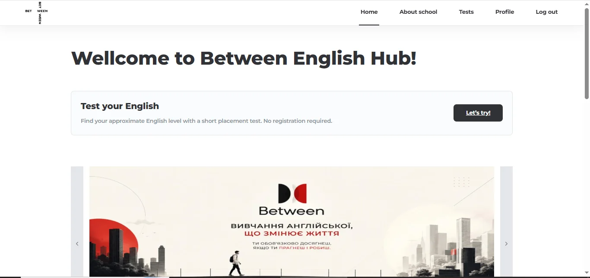
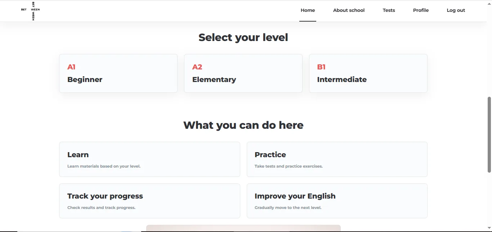
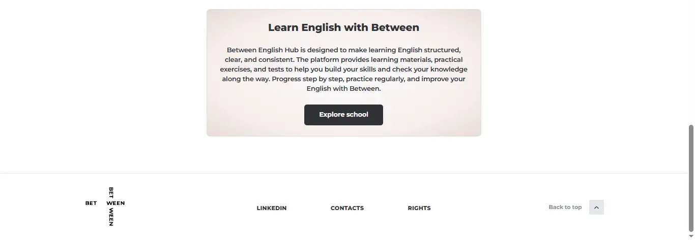
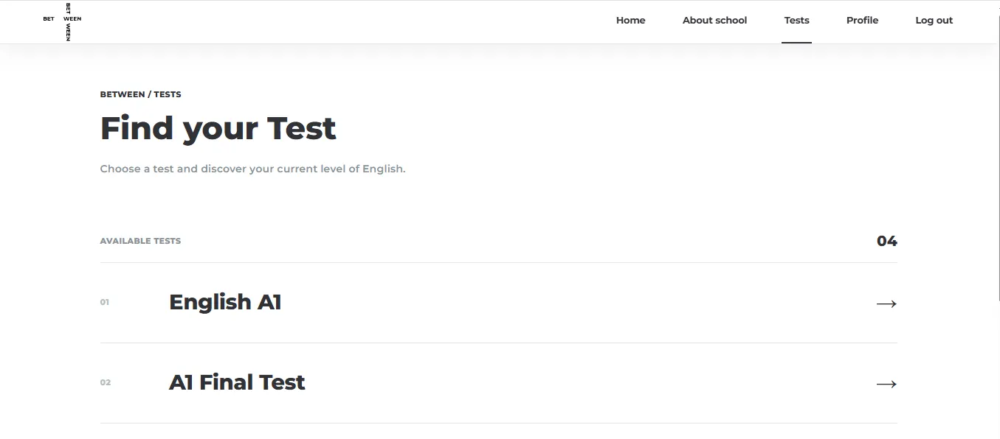
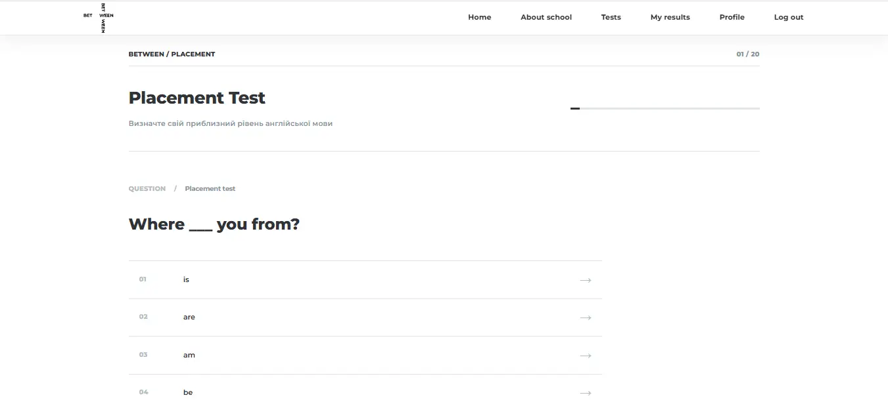
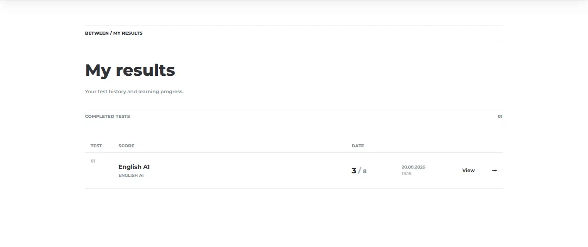
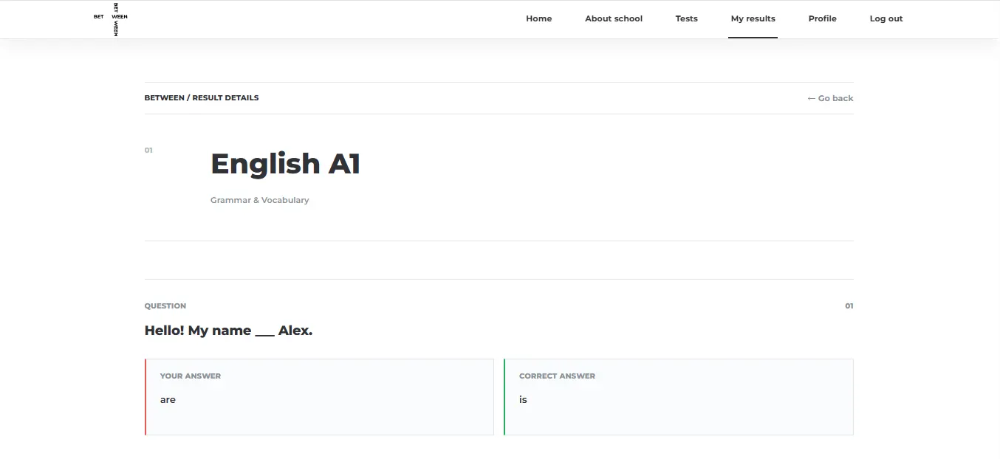
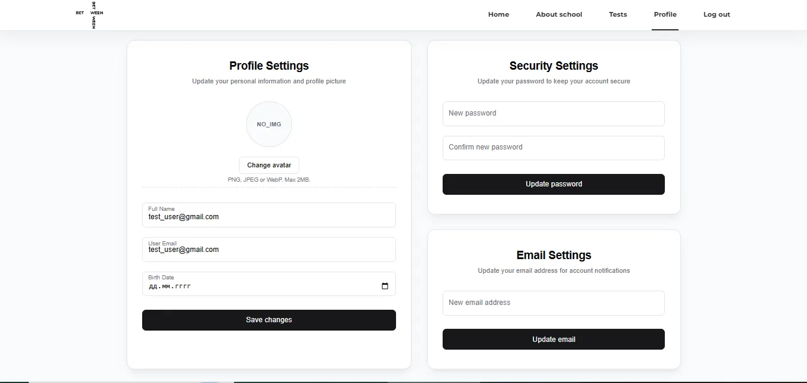
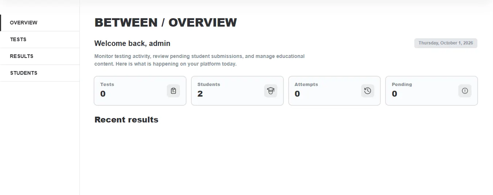

# BETWEEN — English Testing Platform

An English learning platform with CEFR level testing (A1–B2),
personal student profiles, and an administrative panel for teachers.

🔗 **Demo:** [between-etp.vercel.app](https://between-testing-platform.vercel.app/)

## 📸 Screenshots

## 🚀 Main features

- **Authentication and roles** — registration/login via Supabase Auth, user/admin access separation
  via RLS policies at the DB level
- **Placement Test** — free entrance test without registration that determines the user's level
  (A1–B2) using a sequential, threshold-based algorithm
- **Flexible test structure** — tests are divided into parts (`test_parts`) with
  their own ordering and instructions, with support for reading passages in questions
- **Test timer** — a countdown limits the time available to complete a test
- **Results review** — after finishing a test, students can review their results
  and see which answers were correct and which were wrong
- **Score summary** — final score and percentage shown right after submission
- **Progress tracking** — students can see their test history and past results
- **User profiles** — avatars (Supabase Storage), profile editing,
  password and email change
- **Admin panel** — full control over tests and students:
  - view all test results across students
  - browse the student list and see which tests each student has taken
  - create, edit, and delete tests

## 🛠 Technology stack

**Frontend:** React 19, TypeScript, Vite, React Router v7, SCSS Modules  
**Backend:** Supabase (PostgreSQL, Auth, Storage, RLS(Row Level Security))

## 🏗 Architectural solutions

- Question data is normalized via `test_parts` instead of duplicating instructions
  in each question line — easier to maintain and scale
- Anonymous placement test results are not stored in the database — they are calculated
  on the client, which simplifies UX for unregistered users
- RLS policies delimit access at the database level, not just at the UI level

## 🗄 Database Schema

**Content structure** (hierarchical, supports both simple tests and a full LMS):

- **levels** — CEFR levels (A1–C2)
- **submodules** — topics within a level (e.g. "Countries")
- **tests** — `placement_test` / `submodule_quiz` / `final_test`, linked to a level or submodule
- **test_parts** — sections within a test (title, instruction, sort order)
- **questions** — linked to a test and part, supports reading passages via `description`
- **answers** — options per question, with `is_correct` flag

**LMS content (for full course mode):**

- **theory_sections** — theory cards per submodule
- **writing_prompts** / **writing_submissions** — writing tasks and student answers

**Users & results:**

- **profiles** — extends `auth.users` (role, fullname, name, surname, email, avatar, birth date)
- **results** — a completed test attempt (score, user, test)
- **result_answers** — per-question answers within a result
- **teachers** — staff shown on the About page

All access is governed by **Row Level Security (RLS)** — users can only read/write
their own data, while admins get elevated access via role-based policies.

## ⚙️ Running locally

**Test account:**

- email: demo@between-lms.com
- password: demo12345

**How to clone:**

- git clone https://github.com/A1daros/between-lms.git
- cd between-lms
- npm install
- npm run dev

**Required environment variables (`.env`):**

- VITE_SUPABASE_URL=
- VITE_SUPABASE_ANON_KEY=

## 📍 Roadmap

- [ ] Unified styles across all test-taking pages (test list, question page, results).
- [ ] Refactoring the structure, optimizing and converting local states to Redux Toolkit
